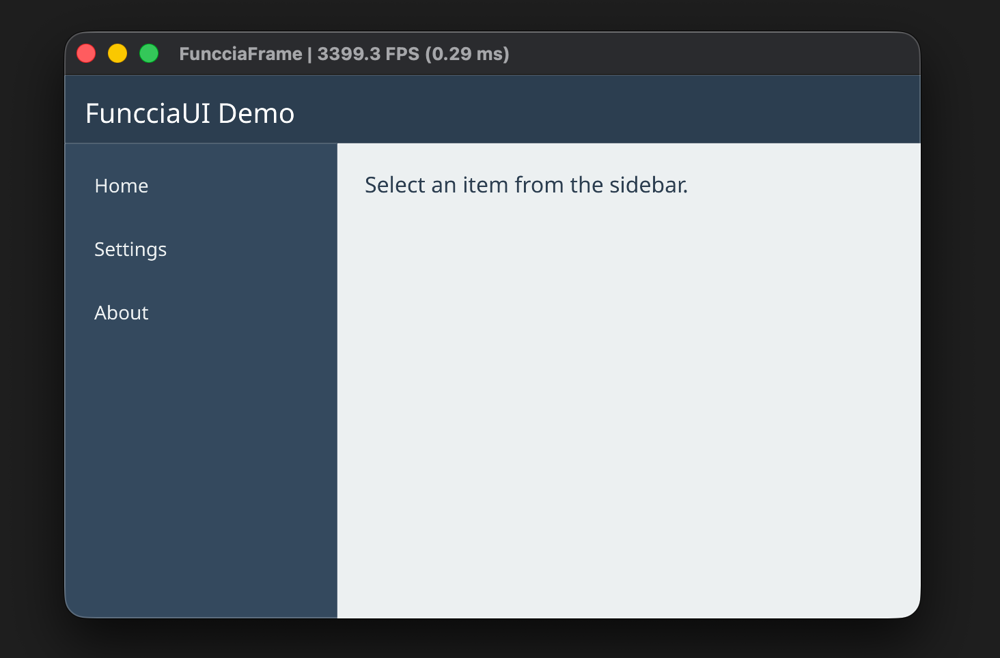

# FuncciaFrame
C++ Game engine in the making. Currently, only the FuncciaUI module is in active development.

---


## Build
1. This project uses Vcpkg for dependency management. [Install Vcpkg](https://learn.microsoft.com/en-us/vcpkg/get_started/overview#get-started-with-vcpkg) first.

2. **Generate glad** for your platform (OpenGL loader):
   - Go to https://glad.dav1d.de/
   - Settings: Language: C/C++, Specification: OpenGL, Profile: Core, Version: 4.1, Generate a loader: Yes
   - Download and extract the include and src folder to `external/glad/`
3. Build the project using CMake with Vcpkg.
```bash
cmake -B build -DCMAKE_TOOLCHAIN_FILE=/path/to/vcpkg/scripts/buildsystems/vcpkg.cmake
cmake --build build
```
- for Visual Studio: a cmake preset is provided in the root folder. Refer to [Vcpkg documents](https://learn.microsoft.com/en-us/vcpkg/get_started/get-started-vs?pivots=shell-powershell)
  - set the environment variable first:
    - `set VCPKG_ROOT=C:\path\to\vcpkg`
    - Or add it permanently in System Environment Variables.
## FuncciaUI
Retained mode DOM tree style UI library.

Current features:
- UI layout
- UI rendering (OpenGL)
- Text layout (HarfBuzz)
- Text rendering (OpenGL, FreeType)
- A declarative JSON based UI definition, supporting parameterized component templates and style sheets.
- Hot reload of UI definitions for faster iteration.

Example:

demo.funccia-ui.json (main UI definition):
```json
{
   "type": "stylesheet",
   "namespace": "demo",
   "styles": {
      "header": {
         "default": {
            "height": 50,
            "horizontal-sizing": "grow",
            "background-color": "#2c3e50ff",
            "padding": 15,
            "font-size": 20,
            "text-color": "#ffffffff"
         }
      },
      "sidebar": {
         "default": {
            "width": 200,
            "vertical-sizing": "grow",
            "background-color": "#34495eff",
            "padding": 10
         }
      },
      "sidebar-item": {
         "default": {
            "horizontal-sizing": "grow",
            "padding": 12,
            "margin-bottom": 5,
            "font-size": 14,
            "text-color": "#ecf0f1ff",
            "border-radius": 4
         },
         "hovered": {
            "background-color": "#3d566eff"
         },
         "selected": {
            "background-color": "#2980b9ff"
         }
      },
      "content": {
         "default": {
            "horizontal-sizing": "grow",
            "vertical-sizing": "grow",
            "background-color": "#ecf0f1ff",
            "padding": 20,
            "font-size": 16,
            "text-color": "#2c3e50ff"
         }
      }
   }
}

```
demo.component-schema.json (reusable components):
```json
{
   "type": "schema-group",
   "namespace": "demo",
   "components": {
      "header": {
         "schema": {
            "content": "$title"
         }
      },
      "sidebar": {
         "schema": {
            "children": "[items]"
         }
      },
      "sidebar-item": {
         "schema": {
            "content": "$text"
         }
      },
      "content": {
         "schema": {
            "content": "$text"
         }
      }
   }
}
```
demo.style.json (styles with hover states):
```json
{
   "type": "stylesheet",
   "namespace": "demo",
   "styles": {
      "header": {
         "default": {
            "height": 50,
            "horizontal-sizing": "grow",
            "background-color": "#2c3e50ff",
            "padding": 15,
            "font-size": 20,
            "text-color": "#ffffffff"
         }
      },
      "sidebar": {
         "default": {
            "width": 200,
            "vertical-sizing": "grow",
            "background-color": "#34495eff",
            "padding": 10
         }
      },
      "sidebar-item": {
         "default": {
            "horizontal-sizing": "grow",
            "padding": 12,
            "margin-bottom": 5,
            "font-size": 14,
            "text-color": "#ecf0f1ff",
            "border-radius": 4
         },
         "hovered": {
            "background-color": "#3d566eff"
         },
         "selected": {
            "background-color": "#2980b9ff"
         }
      },
      "content": {
         "default": {
            "horizontal-sizing": "grow",
            "vertical-sizing": "grow",
            "background-color": "#ecf0f1ff",
            "padding": 20,
            "font-size": 16,
            "text-color": "#2c3e50ff"
         }
      }
   }
}
```